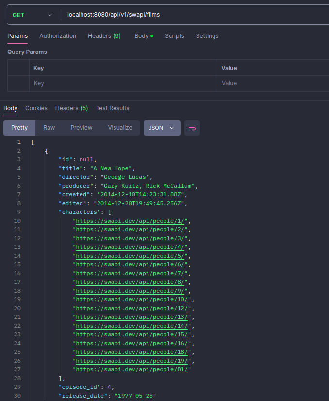
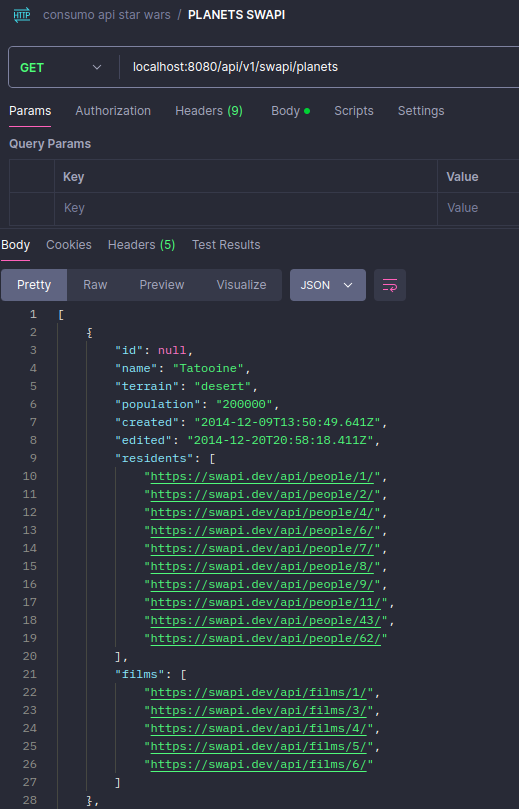
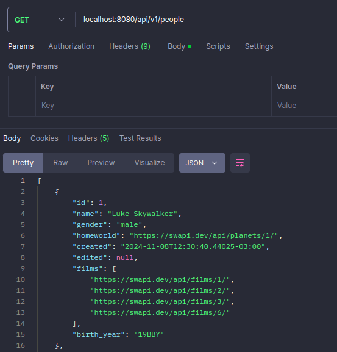

<h1 align="center">
  Star Wars API 🌟
</h1>

## Projeto

- Esta API REST consome a API [SWAPI](https://swapi.dev/documentation), que fornece dados do universo Star Wars. Foram selecionadas operações CRUD e informações sobre planetas, filmes e personagens.
- A integração com a API externa foi implementada usando o **RestTemplate**.
- Fique à vontade para contribuir!

## Funcionalidades
- **Consulta de Dados da SWAPI**: Realiza operações GET para buscar dados diretamente da **SWAPI**.
- **Popular Banco de Dados**: Carrega dados de planetas, filmes e personagens da **SWAPI** para o banco de dados **local** (em memória).
- **Operações CRUD**: Permite criar, ler, atualizar e excluir os registros armazenados no banco de dados **local**.

## Endpoints

- **Documentação**: http://localhost:8080/swagger-ui/index.html

<details>
    <summary><b>Filmes</b></summary>
    
</details>
<details>
    <summary><b>Planetas</b></summary>
    
</details>
<details>
    <summary><b>Personagens</b></summary>
    
</details>

## Tecnologias

- Java
- Spring Boot
- RestTemplate
- Banco de Dados: H2
- Swagger
- Maven

## Configuração e Execução

Pré-requisitos: Java 17 e Maven

```bash
# 1. clone o repositório
git clone https://github.com/isinhah/starwars-api

# 2. acesse o diretório do projeto
cd https://github.com/isinhah/starwars-api

# 3. instale as dependências do Maven
mvn clean install

# 4. configure o banco de dados H2 no application.properties

# 5. execute a aplicação
mvn spring-boot:run

# pressione (ctrl + c) para parar a aplicação
```

## Autor

- Linkedin: https://www.linkedin.com/in/isabel-henrique/
